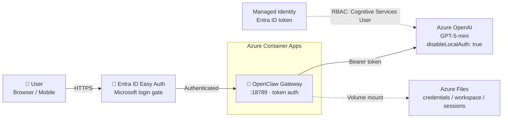

# 🦞 OpenClaw on Azure

> **Alpha** — Experimental reference for hosting [OpenClaw](https://github.com/openclaw/openclaw) on Azure. No production-readiness guarantees. Review all configurations before deploying with sensitive data.

Run [OpenClaw](https://github.com/openclaw/openclaw) — the open-source AI assistant — in an isolated Azure container. No laptop install. No API keys. Nuke-and-pave in one command.

## Why cloud instead of your laptop?

OpenClaw runs arbitrary code and can be deceived by prompt injection. **Don't run it on your work machine.** This template gives you an isolated, ephemeral container instead.

| | Your laptop ❌ | This template ✅ |
|---|---|---|
| **Isolation** | Shares your credentials | Ephemeral container — nothing to compromise |
| **Credentials** | API keys on disk | Managed identity — no keys anywhere |
| **Nuke & pave** | Reinstall OS | `msftclaw down && msftclaw up` (~6 min) |
| **Always on** | Only when open | Always on. `msftclaw stop` = $0 |
| **Teams/mobile** | Only when laptop is on | Always connected |
| **Cost** | Your hardware | ~$2-5/day running, $0 stopped |

## Quick start

### Prerequisites

- [Azure CLI](https://aka.ms/install-azure-cli) + [Azure Developer CLI](https://aka.ms/azd-install)
- [Docker Desktop](https://www.docker.com/products/docker-desktop/) (running)
- An Azure subscription ([free](https://azure.microsoft.com/free))

### Deploy

```bash
git clone https://github.com/microsoft/openclaw
cd openclaw

# macOS/Linux/WSL
./msftclaw up

# Windows (cmd or PowerShell)
.\msftclaw.cmd up
```

First run takes ~6 minutes. Subsequent deploys take ~30 seconds.

### Verify

```bash
msftclaw test
```

### Open the WebChat UI

After deployment, open the URL from `msftclaw status` in your browser. If Entra ID Easy Auth is configured, you'll be prompted to sign in with your Microsoft account — after that the chat UI loads automatically with no further credentials needed.

## CLI reference

```
msftclaw up         Deploy OpenClaw to Azure (provision + build + deploy)
msftclaw test       Verify the deployment is healthy
msftclaw status     Show container status, FQDN, auth mode
msftclaw logs       Stream live container logs
msftclaw start      Scale to 1 replica (resume after stop)
msftclaw stop       Scale to 0 replicas ($0, state preserved)
msftclaw restart    Restart the active revision
msftclaw deploy     Rebuild and deploy after code changes
msftclaw teams      Set up Microsoft Teams integration
msftclaw down       Delete ALL Azure resources (nuke & pave)
msftclaw login      Switch Azure account
```

## What can I do with this?

Your own **always-on AI assistant** — accessible from Teams on your phone, the WebChat UI, or any OpenClaw channel.

- **"Summarize my meeting notes"** — paste transcripts via Teams, get action items
- **"Draft a reply to this email"** — send the thread, get a polished response
- **"Explain this error log"** — paste a stack trace, get a diagnosis
- **"Review this PR"** — paste a GitHub PR link, get code review feedback
- **"Write my weekly status"** — the agent tracks your sessions

## Architecture

| Resource | Purpose |
|---|---|
| **Azure Container Apps** | Hosts OpenClaw gateway — public HTTPS, ephemeral container |
| **Azure OpenAI (GPT-5-mini)** | LLM backend via `/openai/v1/` — keyless (`disableLocalAuth: true`) |
| **Managed Identity** | Container → OpenAI auth via short-lived Entra ID tokens |
| **Entra ID Easy Auth** | Microsoft login required before reaching the gateway |
| **Azure Files** | Persists credentials, workspace, sessions across restarts |
| **Container Registry** | Stores the container image |
| **Log Analytics** | Container and gateway logs |



## Security

### Defense in depth

This template applies **four independent layers** of security. An attacker must defeat all of them to reach the AI backend:

| Layer | What it does |
|---|---|
| **1. Entra ID Easy Auth** | Microsoft login required before any request reaches the container. Deployed automatically by `msftclaw up`. Unauthenticated requests get a 401. Scoped to your tenant. |
| **2. Gateway token** | A random per-container token is injected into the SPA at startup. Even an authenticated user cannot call the WebSocket API without it. |
| **3. Managed Identity (no API keys)** | The container authenticates to Azure OpenAI via short-lived Entra ID tokens. `disableLocalAuth: true` means API keys don't even exist. |
| **4. Ephemeral container** | State is on Azure Files; the container itself is disposable. `msftclaw down && msftclaw up` = clean slate in 6 minutes. |

### What to be aware of

- **Skills run arbitrary code** — a malicious skill can access the managed identity. Only install trusted skills
- **Prompt injection** — OpenClaw is susceptible. Nuke and repave if behavior changes
- **Container runs as root** — add a non-root user for hardened deployments
- **Conversations flow through Azure OpenAI** — don't paste highly sensitive data

### Adding Entra ID Easy Auth

Easy Auth is configured automatically by `msftclaw up`. The preprovision hook creates an Entra ID app registration, Bicep enables the auth config on the Container App, and the postprovision hook updates the redirect URI. No manual steps needed.

To restrict access to specific users or groups, update the app registration in the Azure Portal:
1. **Azure Portal** → **Entra ID** → **App registrations** → `openclaw-auth-<env>`
2. **Properties** → **Assignment required?** → **Yes**
3. **Enterprise applications** → assign specific users/groups

### Usage guidelines

1. **Don't paste confidential data** — conversations flow through Azure OpenAI
2. **Don't install credential-heavy skills** — no email, bank, or internal API skills
3. **Nuke and pave regularly** — `msftclaw down && msftclaw up` if anything seems off
4. **Monitor logs** — `msftclaw logs`

## Teams Setup

Connect OpenClaw to Microsoft Teams so you can chat with it from your phone.

### Step 1: Create an Azure Bot

1. Go to [Azure Portal → Create Azure Bot](https://portal.azure.com/#create/Microsoft.AzureBot)
2. **Bot handle**: `openclaw-bot`, **Type**: Single Tenant, click **Create**
3. Copy the **Microsoft App ID** from Configuration
4. Create a **Client Secret** (Configuration → Manage Password → New)
5. Note your **Tenant ID** (Portal top-right → Directory ID)
6. **Channels** → Add **Microsoft Teams** → Save
7. Set **Messaging endpoint** to: `https://<your-fqdn>/api/messages` (get FQDN from `msftclaw status`)

### Step 2: Configure and deploy

```bash
msftclaw teams    # prompts for App ID, Secret, Tenant ID
msftclaw deploy   # redeploys with Teams config
```

### Step 3: Install in Teams

1. Teams → **Apps** → **Manage your apps** → **Upload a custom app**
2. Select `teams/openclaw-teams-app.zip`
3. **Add** → DM the bot to test

```
Summarize the latest commits on https://github.com/<your-user>/<your-repo>
```

OpenClaw will browse the repo and respond in Teams.

## Troubleshooting

### Container won't start

| Symptom | Cause | Fix |
|---|---|---|
| `Activating` for >2 min | Token acquisition retrying | Normal — allows up to 5 min. Check `msftclaw logs` |
| `ActivationFailed` | Container crashed | Check Azure Portal → Container App → Log stream |
| `Cannot find module '@buape/carbon'` | Cached broken Docker layer | `docker build --no-cache ./src` then `msftclaw deploy` |
| `Config invalid: Unrecognized key` | Old config format | Config must be `{"gateway":{"mode":"local"}}` |

### Auth issues

| Symptom | Cause | Fix |
|---|---|---|
| `401 invalid issuer` | RBAC not propagated | Wait 5 min. Verify: `az role assignment list --assignee <principal-id> --all` |
| Token retries failing | IMDS slow to initialize | Normal — retries for 60s |
| `disableLocalAuth` blocks `list-keys` | By design | Expected — managed identity only |

### Gateway issues

| Symptom | Cause | Fix |
|---|---|---|
| HTTP 500 on all routes | Missing plugin deps | Rebuild with `docker build --no-cache ./src` |
| `pairing required` | Missing `dangerouslyDisableDeviceAuth` or `trustedProxies` in config | Ensure `src/openclaw.json` has both settings (see repo) |
| `Proxy headers detected from untrusted address` | Reverse proxy not trusted | Add `gateway.trustedProxies` with your proxy CIDRs |
| WebChat shows login screen | Token not injected | Check `entrypoint.sh` runs successfully — see `msftclaw logs` |

### CLI issues

| Symptom | Cause | Fix |
|---|---|---|
| `az containerapp exec` crashes | Azure CLI Unicode bug (🦞) | Use Azure Portal Console instead |
| `az containerapp logs` hangs | SSL issue | Use Azure Portal Log stream |
| `azd up` warns about permissions | azd heuristic | Safe to proceed. Or add `User Access Administrator` role |

### Testing Azure OpenAI directly

```bash
TOKEN=$(az account get-access-token --resource "https://cognitiveservices.azure.com" --query accessToken -o tsv)
ENDPOINT=$(az cognitiveservices account list -g <rg> --query "[0].properties.endpoint" -o tsv)

curl -H "Authorization: Bearer $TOKEN" -H "Content-Type: application/json" \
  -d '{"model":"gpt-5-mini","messages":[{"role":"user","content":"Hello"}]}' \
  "$ENDPOINT/openai/v1/chat/completions"
```

## Clean up

```bash
msftclaw down    # Destroys ALL resources
```
