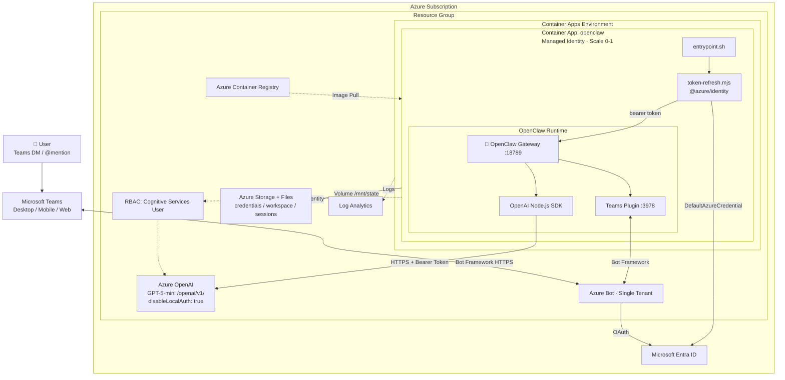

# 🦞 OpenClaw in the Microsoft Cloud

> **Alpha Sample** — This is an experimental reference implementation showing how to host [OpenClaw](https://github.com/openclaw/openclaw) on Azure. It is provided as-is with no security, safety, or production-readiness guarantees. Use at your own risk. Review all infrastructure, authentication, and network configurations before deploying in any environment with sensitive data. This sample has not been through a formal security review.

Run [OpenClaw](https://github.com/openclaw/openclaw) — the open-source personal AI assistant — hosted in Azure. No local machine needed. No API keys to manage. Scales to zero when idle. Just your assistant, ready when you are.

## Why host OpenClaw in the cloud?

| | Local (Mac/PC) | Cloud (this template) |
|---|---|---|
| **Availability** | Only when your machine is on | Always on — scales to zero when idle |
| **API keys** | You manage and rotate them | Zero keys — managed identity with auto-refreshing Entra ID tokens |
| **State** | Lost if disk fails | Persisted on Azure Files — survives restarts, upgrades, crashes |
| **Channels** | Work when your machine is awake | WhatsApp, Telegram, Slack, Discord, Teams always connected |
| **Cost** | Your hardware | Pay-per-use — $0 when stopped, ~$2-5/day when active |
| **Cold start** | N/A | Fast — no VNet overhead |
| **Deploy time** | N/A | ~1 minute with `msftclaw up` |

## Quick start

```bash
git clone https://github.com/microsoft/openclaw
cd openclaw

# macOS/Linux/WSL
./msftclaw up

# Windows (cmd or PowerShell)
.\msftclaw.cmd up
```

That's it. The CLI handles Azure login, infrastructure provisioning, container build, and deployment.

## CLI commands

```
msftclaw up         Deploy OpenClaw to Azure
msftclaw test       Verify it's working
msftclaw teams      Set up Microsoft Teams integration
msftclaw start      Start the agent
msftclaw stop       Stop the agent (state preserved, $0 charges)
msftclaw restart    Restart the agent
msftclaw status     Check agent status
msftclaw logs       Stream live logs
msftclaw deploy     Rebuild and deploy after code changes
msftclaw down       Delete all Azure resources
msftclaw login      Switch Azure account
```

## Testing your deployment

After `msftclaw up`, run `msftclaw test` to verify the deployment. Then test the agent:

```bash
# Check status
msftclaw status

# Open a shell in the container
az containerapp exec --name <app-name> --resource-group <rg> --command /bin/bash

# Inside the container — test the agent
openclaw agent --message "Hello from the Microsoft Cloud!"

# Verify managed identity auth
echo "Auth: $AZURE_OPENAI_AUTH"
echo "Endpoint: $OPENAI_BASE_URL"
```

## What can I do with this?

Your own **always-on AI assistant** — accessible from Microsoft Teams on your phone, laptop, or any device with your work profile.

### Personal productivity (try these first)

- **"Summarize my meeting notes"** — paste transcripts via Teams DM, get structured action items back
- **"Draft a reply to this email"** — send the email thread, get a polished response
- **"Explain this error log"** — paste a stack trace, get a plain-English diagnosis
- **"Research this topic"** — get a structured brief with web search and citations

### Enterprise workflows (natural next steps)

- **PR review assistant** — paste a PR link in Teams, get code quality and security feedback
- **Teams auto-support** — point the agent at a support channel, it handles common questions
- **Document drafting** — "Write a one-pager on X for my VP" — iterates until you're satisfied
- **Weekly status reports** — the agent tracks your sessions, so "write my weekly status" works

### Why Teams + mobile works well

OpenClaw has a [bundled MS Teams plugin](https://docs.openclaw.ai/channels/msteams). Set it up with `msftclaw teams`:

- **DM the bot from Teams desktop or mobile** — works on your phone's work profile
- **Add it to a team channel** — the agent responds when @mentioned
- **Adaptive Cards** — polls, structured responses, and interactive cards
- **File handling** — send documents via Teams DM, the agent processes them

### What works vs. desktop

| Capability | Cloud | Desktop |
|---|---|---|
| Agent + gateway | ✅ | ✅ |
| Teams / Slack / Discord / Telegram | ✅ Always connected | ⚠️ Only when machine is on |
| Browser automation | ✅ (headless Chromium) | ✅ |
| Code execution | ✅ | ✅ |
| Skills + workspace | ✅ (persisted on Azure Files) | ✅ |
| Scale to zero | ✅ ($0 when idle) | N/A |
| Camera / screen capture / notifications | ❌ (pair a device node) | ✅ |
| Voice Wake / Talk Mode | ❌ (pair an iOS/Android node) | ✅ |

## Security

No API keys. No secrets to rotate. Authentication is managed identity only.

| Layer | Control |
|---|---|
| **Azure OpenAI** | `disableLocalAuth: true` — no API keys exist; only Entra ID tokens work |
| **Auth** | Managed identity + `getBearerTokenProvider` — auto-refreshing, short-lived JWT tokens |
| **RBAC** | `Cognitive Services User` scoped to the specific Azure OpenAI resource |
| **OpenClaw** | `dmPolicy: "pairing"` — unknown senders are blocked until approved |
| **Transport** | HTTPS/TLS on Microsoft backbone between all services |
| **Container** | Runs as a single container with no elevated privileges |
| **Storage** | TLS 1.2 minimum; shared key access for Azure Files volume mount |

### Known considerations

- **Public ingress** — the ACA container app has a public FQDN. The OpenClaw gateway itself handles authentication via its pairing mode, but the HTTP endpoint is reachable. For network isolation, see the [VNet isolation](#advanced-vnet-isolation) section.
- **ACR admin credentials** — the container registry uses admin user/password (stored as ACA secrets) for image pull. Consider switching to managed identity-based ACR pull for production.
- **Storage shared key** — Azure Files volume mount uses a storage account key (required by ACA). The key is stored as an ACA-managed secret, not in code.
- **Container runs as root** — the default `node:24-slim` image runs as root. For hardened deployments, add a non-root user to the Dockerfile.
- **No WAF or rate limiting** — there is no Azure Application Gateway, Front Door, or rate limiting in front of the container app. OpenClaw's built-in pairing provides application-level auth, but there is no DDoS protection beyond ACA's defaults.

> This is an alpha sample. Review and harden these areas before using with sensitive data or in a production environment.

## Troubleshooting

| Issue | Cause | Fix |
|---|---|---|
| `msftclaw test` shows "Activating" | Container is starting up | Wait 1-2 minutes and retry |
| `ActivationFailed` status | Container entrypoint crashed | Run `msftclaw logs` — common cause: CRLF line endings (fixed in Dockerfile with `sed -i 's/\r$//'`) |
| `ERR_MODULE_NOT_FOUND: @azure/identity` | Node.js ESM can't find packages installed globally | Dockerfile installs `@azure/identity` locally in `/opt/openclaw-auth/` alongside `token-refresh.mjs` |
| Pre-flight warning about `roleAssignments/write` | azd checks permissions before deploying | Type `Y` to proceed — the warning is advisory only |
| `disableLocalAuth` prevents `list-keys` | No API keys exist by design | Expected — managed identity is the only auth method |
| Logs show `[auth] Fatal` | Managed identity token acquisition failed | Verify the role: `az role assignment list --scope <openai-resource-id>` |
| Docker build uses cached image | `azd deploy` reuses Docker cache | Force rebuild: `docker build --no-cache -t <tag> ./src` |
| State lost after restart | Azure Files mount issue | Check volume config in `az containerapp show` |
| Container scaled to zero, not responding | Scale-to-zero is active | Run `msftclaw start` or send a request — ACA scales up automatically on HTTP traffic |

## Clean up

```bash
msftclaw down
```

---

## Advanced: architecture

<details>
<summary>Click to expand full architecture details</summary>

### What's deployed

| Resource | Purpose |
|---|---|
| Azure OpenAI (GPT-5-mini) | LLM backend via `/openai/v1` (keyless auth only, `disableLocalAuth: true`) |
| Azure Container Apps | Hosts the OpenClaw gateway — scale-to-zero enabled |
| Azure Files | Persists state (credentials, workspace, sessions) across restarts |
| Azure Container Registry | Stores the custom OpenClaw container image |
| Log Analytics | Gateway and container logs |

### Resource diagram



### How Azure OpenAI integration works

OpenClaw natively uses the OpenAI Node.js SDK. The container sets `OPENAI_BASE_URL` to the Azure OpenAI v1 endpoint. Authentication uses `getBearerTokenProvider` from `@azure/identity` ([same pattern as the Azure OpenAI Starter Kit](https://github.com/Azure-Samples/azure-openai-starter/blob/main/src/typescript/responses_example_entra.ts)):

```js
const credential = new DefaultAzureCredential();
const tokenProvider = getBearerTokenProvider(credential,
    "https://cognitiveservices.azure.com/.default");
const token = await tokenProvider();
```

### Auth flow

```
Container App                    Entra ID                    Azure OpenAI
     │                              │                             │
     │  1. getBearerTokenProvider() │                             │
     │  ──────────────────────────▶ │                             │
     │     scope: cognitiveservices │                             │
     │       .azure.com/.default   │                             │
     │                              │                             │
     │  2. Bearer token (JWT)       │                             │
     │  ◀────────────────────────── │                             │
     │                              │                             │
     │  3. Set OPENAI_API_KEY=token │                             │
     │  ─── spawn openclaw gateway  │                             │
     │                              │                             │
     │  4. OpenAI SDK request       │                             │
     │  ─────────────────────────────────────────────────────────▶│
     │     Authorization: Bearer <token>                          │
     │     POST /openai/v1/chat/completions                       │
     │                              │                             │
     │  5. Response                 │                             │
     │  ◀─────────────────────────────────────────────────────────│
     │                              │                             │
     │  ... (every 45 min)          │                             │
     │  6. tokenProvider() refresh  │                             │
     │  ──────────────────────────▶ │                             │
     │  7. Fresh token              │                             │
     │  ◀────────────────────────── │                             │
     │  8. Update OPENAI_API_KEY    │                             │
     │                              │                             │
```

### Project structure

```
msftclaw                    # Bash CLI (macOS/Linux/WSL)
msftclaw.cmd                # Windows CLI (cmd/PowerShell)
azure.yaml                  # azd service definition

src/
  Dockerfile                # Container image (node:24-slim + openclaw + @azure/identity)
  entrypoint.sh             # State restore/save + gateway launch
  token-refresh.mjs         # Managed identity → bearer token for OpenAI SDK
  openclaw.json             # Agent config (model: openai/gpt-5-mini)

infra/
  main.bicep                # Top-level orchestration
  main.parameters.json      # azd parameter bindings
  resources.bicep           # Azure OpenAI resource
  aca.bicep                 # ACA environment, storage, container app, RBAC

teams/
  manifest.json             # Teams app manifest template

validate.sh                 # Automated validation script
```

</details>
