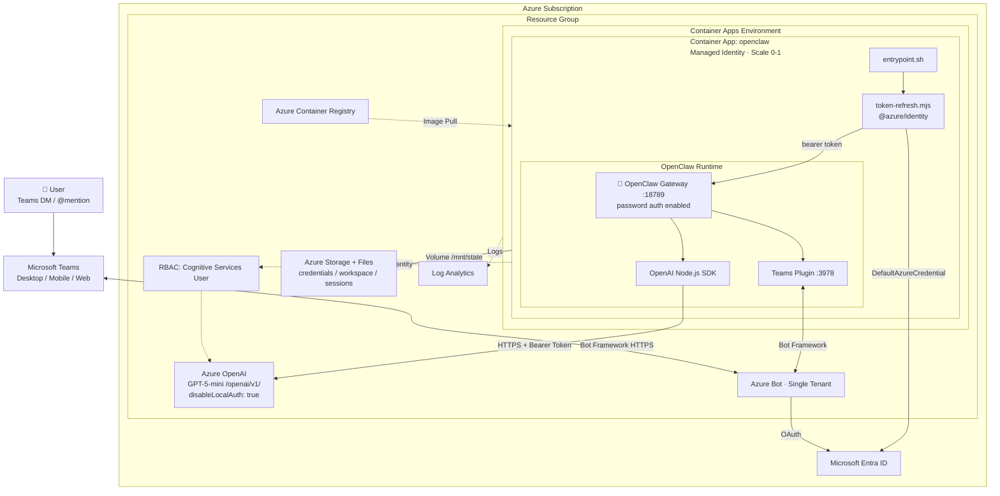

# 🦞 OpenClaw in the Microsoft Cloud

> **Alpha Sample** — This is an experimental reference implementation showing how to host [OpenClaw](https://github.com/openclaw/openclaw) on Azure. It is provided as-is with no security, safety, or production-readiness guarantees. Use at your own risk. Review all infrastructure, authentication, and network configurations before deploying in any environment with sensitive data. This sample has not been through a formal security review.

Run [OpenClaw](https://github.com/openclaw/openclaw) — the open-source personal AI assistant — hosted in an isolated Azure container. No tenant-joined machine needed. No API keys to manage. Scales to zero when idle. Nuke-and-pave in one command.

## Why host OpenClaw in the cloud instead of your machine?

OpenClaw is powerful but runs arbitrary code, downloads instructions from the internet, and can be deceived by prompt injection. **Do not run it on your work laptop or any tenant-joined machine.** This template gives you a dedicated, isolated container instead.

| | Your laptop (DON'T) | Dedicated VM (traditional) | This template (ACA) |
|---|---|---|---|
| **Isolation** | ❌ Shares your credentials | ✅ Separate VM | ✅ Ephemeral container — no host to compromise |
| **Nuke & pave** | Reinstall OS | Delete VM, recreate | `msftclaw down && msftclaw up` (~1 min) |
| **Credentials** | ❌ Your real creds on disk | ⚠️ API keys on VM | ✅ Managed identity — no keys anywhere |
| **State backup** | Manual | Manual | ✅ Azure Files (automatic, separate from compute) |
| **Always on** | ❌ Only when laptop open | ✅ But you pay 24/7 | ✅ Always on (1 replica). Scale to 0 with `msftclaw stop` when not needed |
| **Cost** | Your hardware | ~$50-100/mo | ~$2-5/day when running, $0 when stopped |

## Quick start

```bash
git clone https://github.com/microsoft/openclaw
cd openclaw

# macOS/Linux/WSL
./msftclaw up

# Windows (cmd or PowerShell)
.\msftclaw.cmd up
```

The CLI handles Azure login, infrastructure provisioning, container build, and deployment.

## CLI commands

```
msftclaw up         Deploy OpenClaw to Azure
msftclaw test       Verify it's working
msftclaw teams      Set up Microsoft Teams integration
msftclaw start      Start the agent (scale to 1)
msftclaw stop       Stop the agent (scale to 0, state preserved, $0)
msftclaw restart    Restart the agent
msftclaw status     Check agent status
msftclaw logs       Stream live logs
msftclaw deploy     Rebuild and deploy after code changes
msftclaw down       Delete ALL Azure resources (nuke & pave)
msftclaw login      Switch Azure account
```

## Testing your deployment

```bash
# Check status
msftclaw status

# Shell into the container
az containerapp exec --name <app-name> --resource-group <rg> --command /bin/bash

# Inside the container:
openclaw agent --message "Hello from the Microsoft Cloud!"
echo "Auth: $AZURE_OPENAI_AUTH"       # → managed-identity
echo "Endpoint: $OPENAI_BASE_URL"     # → https://<resource>.openai.azure.com/openai/v1/
```

## What can I do with this?

Your own **always-on AI assistant** in an isolated container — accessible from Teams on your phone or any messaging channel.

### Try these first

- **"Summarize my meeting notes"** — paste transcripts via Teams DM, get structured action items
- **"Draft a reply to this email"** — send the thread, get a polished response
- **"Explain this error log"** — paste a stack trace, get a plain-English diagnosis
- **"Research this topic"** — get a structured brief with web search and citations

### Enterprise workflows

- **PR review assistant** — paste a PR link in Teams, get code quality and security feedback
- **Teams auto-support** — point the agent at a support channel, it handles common questions
- **Document drafting** — "Write a one-pager on X for my VP"
- **Weekly status reports** — the agent tracks your sessions, so "write my weekly status" works

### Teams + mobile

OpenClaw has a [bundled MS Teams plugin](https://docs.openclaw.ai/channels/msteams). Set it up with `msftclaw teams`:

- DM the bot from Teams desktop or mobile (works on your phone's work profile)
- Add it to a team channel — the agent responds when @mentioned
- Adaptive Cards, polls, file handling

### What works vs. desktop

| Capability | Cloud | Desktop |
|---|---|---|
| Agent + gateway | ✅ | ✅ |
| Teams / Slack / Discord / Telegram | ✅ Always connected | ⚠️ Only when machine is on |
| Browser automation | ✅ (headless Chromium) | ✅ |
| Code execution | ✅ | ✅ |
| Skills + workspace | ✅ (Azure Files) | ✅ |
| Scale to zero | ✅ ($0 when idle) | N/A |
| Camera / screen / notifications | ❌ | ✅ |
| Voice Wake / Talk Mode | ❌ | ✅ |

## Security

### How this template addresses the core risks

OpenClaw runs arbitrary code and can be deceived by prompt injection. This template mitigates the major risks:

| Risk | Mitigation |
|---|---|
| **"Don't run on your work laptop"** | ✅ Runs in an isolated ACA container — not on any tenant-joined machine. No access to your host, credentials, or corporate network |
| **"Machine gets compromised"** | ✅ Container is ephemeral. `msftclaw down` destroys everything. `msftclaw up` rebuilds from source in ~1 min. No persistent OS to compromise |
| **"API keys get stolen"** | ✅ No API keys exist anywhere. `disableLocalAuth: true` on Azure OpenAI. Managed identity with short-lived Entra ID tokens only |
| **"Back up and nuke often"** | ✅ State is on Azure Files (separate from compute). `msftclaw down && msftclaw up` nukes the container and redeploys with state intact |
| **"Credentials on disk"** | ✅ No credentials stored in the container. Managed identity is injected by the platform. Azure Files mount key is an ACA-managed secret |
| **"Download random instructions"** | ⚠️ OpenClaw skills can still download and execute code. Be selective about which skills you install (see guidelines below) |
| **"Prompt injection / memory poisoning"** | ⚠️ OpenClaw is susceptible to these attacks. Back up your workspace regularly and restore from a known good state if behavior changes |

### Security controls in this template

| Layer | Control |
|---|---|
| **Gateway access** | `gateway.auth.mode: "password"` — all API, WebChat, and Control UI access requires a password |
| **Azure OpenAI** | `disableLocalAuth: true` — no API keys exist; only Entra ID tokens work |
| **Auth** | Managed identity + `getBearerTokenProvider` — auto-refreshing, short-lived JWT tokens |
| **RBAC** | `Cognitive Services User` scoped to a single Azure OpenAI resource |
| **Channel auth** | `dmPolicy: "pairing"` — unknown senders on Teams/Telegram/etc. blocked until approved |
| **Transport** | HTTPS/TLS between all services |
| **Compute** | Ephemeral container — no persistent OS, no SSH, no host access |
| **State** | Azure Files — separated from compute, survives nuke-and-pave |

### Setting your gateway password

After deployment, set the password:

```bash
az containerapp exec --name <app-name> --resource-group <rg> --command /bin/bash

# Inside the container
openclaw gateway set-password
```

### Usage guidelines (important)

Following the spirit of enterprise security guidance for OpenClaw:

1. **Do NOT enter confidential data** — do not paste proprietary code, customer data, financial information, or anything classified into OpenClaw. The LLM backend processes your input and the data flows through the model
2. **Do NOT install sensitive-credential skills** — do not install skills that require access to email, Microsoft login, bank accounts, or internal APIs
3. **Be thoughtful about channels** — if connecting to Microsoft Teams, understand that conversation data flows through the OpenClaw gateway and Azure OpenAI. Use an ephemeral or non-production tenant if possible. For lower risk, use WhatsApp, Discord, or Signal instead
4. **Back up your workspace** — Azure Files persists state automatically, but you should periodically snapshot your workspace to a known good state:
   ```bash
   # Download current state
   az storage file download-batch --source openclaw-state --destination ./backup --account-name <storage-account>
   ```
5. **Nuke and pave regularly** — if the agent behaves strangely (signs of memory poisoning or prompt injection), destroy and redeploy:
   ```bash
   msftclaw down    # destroy everything
   msftclaw up      # redeploy fresh from source
   # Then restore workspace from your last known-good backup
   ```
6. **Monitor the logs** — watch for unexpected behavior:
   ```bash
   msftclaw logs
   ```

### Known considerations

- **Public FQDN** — the container app has a public URL. Gateway password auth protects all endpoints, but the FQDN is discoverable. For additional protection, add Azure Front Door with WAF or configure Entra ID Easy Auth on the ACA ingress
- **ACR admin credentials** — uses admin user/password for image pull (stored as ACA secrets). Consider managed identity-based ACR pull for hardened deployments
- **Storage shared key** — Azure Files mount requires a storage account key (ACA limitation). Stored as an ACA-managed secret, not in code
- **Container runs as root** — the `node:24-slim` base image runs as root. Add a non-root user for hardened deployments
- **No WAF or rate limiting** — no Azure Front Door or Application Gateway. Gateway password auth is the access gate
- **Skills can run arbitrary code** — OpenClaw skills execute in the container. A malicious skill can access the container's managed identity. Only install skills you trust

## Troubleshooting

| Issue | Cause | Fix |
|---|---|---|
| `msftclaw test` shows "Activating" | Container starting up (startup probe allows up to 5 min) | Wait 1-2 minutes and retry |
| `ActivationFailed` | Entrypoint crashed | Run `msftclaw logs` — see common causes below |
| `Cannot find module` (any package) | OpenClaw npm package ships a stale `package-lock.json` that makes `npm install` think deps are satisfied when they're not | Fixed in Dockerfile: `rm -f package-lock.json && npm install` forces fresh resolution. See [openclaw#62749](https://github.com/openclaw/openclaw/issues/62749) |
| `npm install` reports "up to date" but deps missing | The published lockfile reflects the pnpm workspace layout, not the npm install tree | Delete the lockfile first: `cd node_modules/openclaw && rm -f package-lock.json && npm install` |
| `ERR_MODULE_NOT_FOUND: @azure/identity` | Node.js ESM resolves from the file's directory, not CWD | Dockerfile installs `@azure/identity` in `/opt/openclaw-auth/` alongside `token-refresh.mjs` |
| CRLF line endings break entrypoint | Git on Windows converts LF to CRLF | Fixed in Dockerfile: `sed -i 's/\r$//' /opt/entrypoint.sh` |
| `openclaw doctor --fix` fails with missing module | Config loading requires the same missing deps — chicken-and-egg | Delete lockfile + npm install instead. See [openclaw#62759](https://github.com/openclaw/openclaw/issues/62759) |
| `azd deploy` doesn't pick up Dockerfile changes | Docker layer caching | Force rebuild: `docker build --no-cache -t <tag> ./src` |
| Pre-flight `roleAssignments/write` warning | azd permissions heuristic | Type Y — deployment works. Or assign yourself `User Access Administrator`. See [azure-dev#7569](https://github.com/Azure/azure-dev/issues/7569) |
| `az containerapp logs show` SSL error | Intermittent during container restarts | Use Azure Portal log stream instead. See [azure-cli#33146](https://github.com/Azure/azure-cli/issues/33146) |
| `az containerapp exec` SSL error | CLI websocket issue | Use Azure Portal Console instead. See [azure-cli#33147](https://github.com/Azure/azure-cli/issues/33147) |
| `disableLocalAuth` prevents `list-keys` | No API keys by design | Expected — managed identity only |
| `[auth] Fatal` in logs | Token acquisition failed | Verify role: `az role assignment list --scope <openai-id>` |
| Container keeps restarting | Default startup probe too aggressive | Fixed in Bicep: startup probe allows 60 retries x 5s = 5 min boot window |
| Agent behaves strangely | Possible memory poisoning / prompt injection | Restore workspace from backup or `msftclaw down && msftclaw up` |

## Clean up

```bash
msftclaw down    # destroys ALL resources — compute, storage, registry, OpenAI
```

---

## Advanced: architecture

<details>
<summary>Click to expand full architecture details</summary>

### What's deployed

| Resource | Purpose |
|---|---|
| Azure OpenAI (GPT-5-mini) | LLM backend via `/openai/v1` — keyless only (`disableLocalAuth: true`) |
| Azure Container Apps | Hosts OpenClaw gateway — scale-to-zero, ephemeral container |
| Azure Files | Persists state (credentials, workspace, sessions) — separate from compute |
| Azure Container Registry | Stores the custom container image |
| Log Analytics | Gateway and container logs |

### Resource diagram



### Auth flow

```
Container App                    Entra ID                    Azure OpenAI
     │                              │                             │
     │  1. getBearerTokenProvider() │                             │
     │  ──────────────────────────▶ │                             │
     │     scope: cognitiveservices │                             │
     │       .azure.com/.default   │                             │
     │                              │                             │
     │  2. Bearer token (JWT)       │                             │
     │  ◀────────────────────────── │                             │
     │                              │                             │
     │  3. Set OPENAI_API_KEY=token │                             │
     │  ─── spawn openclaw gateway  │                             │
     │                              │                             │
     │  4. OpenAI SDK request       │                             │
     │  ─────────────────────────────────────────────────────────▶│
     │     Authorization: Bearer <token>                          │
     │     POST /openai/v1/chat/completions                       │
     │                              │                             │
     │  5. Response                 │                             │
     │  ◀─────────────────────────────────────────────────────────│
     │                              │                             │
     │  ... (every 45 min)          │                             │
     │  6. tokenProvider() refresh  │                             │
     │  ──────────────────────────▶ │                             │
     │  7. Fresh token              │                             │
     │  ◀────────────────────────── │                             │
     │  8. Update OPENAI_API_KEY    │                             │
     │                              │                             │
```

### Project structure

```
msftclaw                    # Bash CLI (macOS/Linux/WSL)
msftclaw.cmd                # Windows CLI (cmd/PowerShell)
azure.yaml                  # azd service definition

src/
  Dockerfile                # Container image (node:24-slim + openclaw + @azure/identity)
  entrypoint.sh             # State restore/save + gateway launch
  token-refresh.mjs         # Managed identity → bearer token for OpenAI SDK
  openclaw.json             # Agent config (model + gateway password auth)

infra/
  main.bicep                # Top-level orchestration
  main.parameters.json      # azd parameter bindings
  resources.bicep           # Azure OpenAI resource (disableLocalAuth: true)
  aca.bicep                 # ACA environment, storage, container app, RBAC

teams/
  manifest.json             # Teams app manifest template

validate.sh                 # Automated validation script
```

</details>
