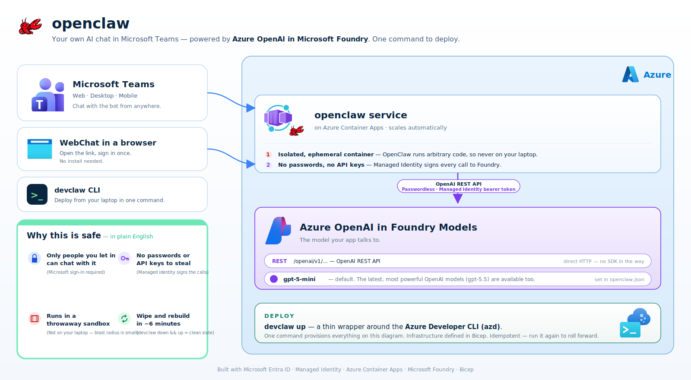
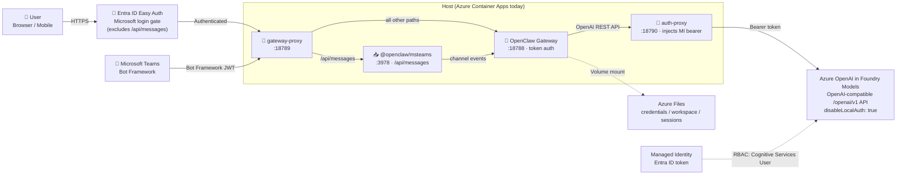

<!--
---
page_type: sample
languages:
- javascript
products:
- azure-openai
- azure
urlFragment: openclaw-dev
name: openclaw-dev
description: Deploy OpenClaw with Azure OpenAI using one CLI command. Chat in the browser by default; optionally add Microsoft Teams to use it from your phone.
---
-->
# 🦞 openclaw-dev

A small dev tool that deploys [OpenClaw](https://github.com/openclaw/openclaw) as a hosted assistant you can talk to in the browser. Uses Azure OpenAI in Foundry Models for the backend (default `gpt-5-mini`). Microsoft Teams is an optional add-on.

Short link: <https://aka.ms/openclaw-dev>

<a id="alpha"></a>

> **⚠️ Alpha.** This is a developer tool with no production guarantees. Read [Security](#security) before pasting anything sensitive.



The idea: OpenClaw is a useful agent runtime, but it runs arbitrary code. This repo deploys it to a disposable cloud sandbox, gated by your Microsoft sign-in, with no model API keys. One command up, one command down.

→ Jump to: [Quick start](#quick-start) · [Optional: Microsoft Teams](#teams-setup) · [Security](#security) · [Architecture](#architecture) · [Alpha caveats](#alpha) · [Ask Copilot](#need-help-ask-copilot)

## Quick start

### Prerequisites

- [Azure CLI](https://aka.ms/install-azure-cli) + [Azure Developer CLI](https://aka.ms/azd-install)
- An Azure subscription ([free](https://azure.microsoft.com/free)) and tenant where you can create one Entra ID app registration (the Easy Auth login gate). A second Bot app registration is only created if you opt into the [Teams add-on](#teams-setup).
- Either local [Docker Desktop](https://www.docker.com/products/docker-desktop/) running **or** use the default `remoteBuild: true` in [azure.yaml](azure.yaml) (no local Docker needed; ACR builds the image)
- PowerShell 7+ (`pwsh`) if you're on Windows and plan to use the optional Teams add-on (used to build the Teams sideload zip)

### Deploy

```bash
git clone https://github.com/microsoft/openclaw-dev
cd openclaw-dev

# macOS/Linux/WSL
./devclaw up

# Windows (cmd or PowerShell)
.\devclaw.cmd up
```

On first run, `azd` prompts for a subscription, region, and environment name (a new resource group `rg-<env-name>` is created automatically). First deploy takes ~6 minutes (provision ~2 min + remote build & deploy ~3.5 min). Subsequent `devclaw deploy` runs take ~3-4 minutes for a remote build, or ~30s if only the entrypoint changed.

### Verify

```bash
devclaw status   # Container state, FQDN, RG
devclaw logs     # Tail logs until you see `[gateway] starting HTTP server`
```

`devclaw test` only prints a hint that points you at the in-container console. It does not exercise the model end-to-end. The fastest real smoke test is the WebChat UI below.

### Open the WebChat UI

After deployment, open the URL from `devclaw status` in your browser. If Entra ID Easy Auth is configured, you'll be prompted to sign in with your Microsoft account. After that the chat UI loads automatically with no further credentials needed.

<a id="teams-setup"></a>
## Optional: Microsoft Teams add-on

Microsoft Teams is **not** set up by default — `devclaw up` only provisions the
browser experience (Container App + Easy Auth login). The Teams add-on adds a
second Entra ID app registration (for the bot), an Azure Bot resource, and the
Teams channel. Keep it off if your tenant blocks bot app registrations or you
don't need phone access.

### Enable Teams

```bash
# Opt in once, then run devclaw teams. It will re-provision and build the
# sideload zip in one go.
azd env set ENABLE_TEAMS true
devclaw teams
```

`devclaw teams` will, on first run:
- Re-provision so the preprovision hook creates the bot Entra ID app + Azure Bot
- Redeploy the container app so the `MSTEAMS_*` env vars take effect
- Enable the Microsoft Teams channel on the bot
- Build a sideloadable Teams app package (`teams/openclaw-teams-app.zip`)

On subsequent runs it just refreshes the channel + zip.

### Install in Teams

1. Teams → **Apps** → **Manage your apps** → **Upload a custom app**
2. Select `teams/openclaw-teams-app.zip`
3. **Add** → DM the bot to test

### Tenant policy considerations

Some corporate tenants block `az ad app credential reset` (the secret-creation
step) or require a `serviceManagementReference` on new app registrations. If
the preprovision hook fails when you set `ENABLE_TEAMS=true`, your tenant is
restricted; leave Teams off and use the browser experience instead, or create
the bot app registration manually and set `BOT_APP_ID`, `BOT_APP_SECRET`,
and `BOT_TENANT_ID` via `azd env set` before running `devclaw teams`.

## Restricted subscriptions / tenants

If your subscription or tenant has Azure Policy assignments that block common
defaults (Microsoft corp subscriptions are a common example), set these
**before** `devclaw up`:

```bash
# Required service-tree GUID on every new app registration (Microsoft corp).
azd env set SERVICE_MANAGEMENT_REFERENCE <your-service-tree-guid>

# Azure Policy blocks shared-key storage. ACA file mounts need shared keys
# today, so skip the storage account + Azure Files volume mount.
# Trade-off: gateway token + sessions don't persist across replica restarts.
azd env set SKIP_STORAGE true

# Leave Teams off (default already) — bot secret creation is blocked.
# If you need Teams, supply a pre-created bot app reg:
#   azd env set BOT_APP_ID <id>
#   azd env set BOT_APP_SECRET <secret>
#   azd env set BOT_TENANT_ID <tenant>
#   azd env set ENABLE_TEAMS true
```

You don't need a separate `SKIP_BOT_REGISTRATION` flag — Teams is already
off by default. Other policies handled automatically: ACR admin is disabled
out of the box (the container app pulls images via its system-assigned
managed identity).

<details>
<summary>How the Teams integration works (deep dive)</summary>

The Teams channel is handled by **`@openclaw/msteams`**, an external OpenClaw plugin installed at container-build time. It opens its own Express server on `:3978` for the Bot Framework webhook (`/api/messages`). Because ACA exposes only a single public port, [src/gateway-proxy.mjs](src/gateway-proxy.mjs) listens on `:18789` and routes `/api/messages` to the plugin and everything else to the OpenClaw gateway.

The plugin must be **explicitly activated** in [src/openclaw.json](src/openclaw.json); `channels.msteams.enabled: true` alone is not enough for external (non-bundled) plugins. The repo ships with the required block already in place:

```json
"plugins": {
  "enabled": true,
  "allow": ["msteams"],
  "entries": { "msteams": { "enabled": true } }
}
```

If you ever see startup logs like `[gateway] http server listening (N plugins: …)` **without** `msteams` in the list, that block is missing or has been overwritten by a stale state file on Azure Files. The entrypoint restores [src/openclaw.json](src/openclaw.json) from the canonical copy on every boot to prevent this drift.

</details>

## Why

The whole point of this template is the safety story. Four things, in plain words:

- 🔒 **Only people you let in can chat with it.** Microsoft sign-in via Entra ID, scoped to your tenant.
- 🗝️ **No model API keys.** A managed identity calls the model. Local auth is disabled at the model account, so model keys don't exist.
- 🧪 **Runs in a throwaway cloud sandbox, not on your laptop.** A bad prompt or a malicious skill can't reach your laptop's credentials.
- ♻️ **Wipe and rebuild in about 6 minutes.** `devclaw down && devclaw up` gives you a clean slate.

OpenClaw runs arbitrary code and can be deceived by prompt injection. **Don't run it on your work machine.** This template gives you an isolated, ephemeral container instead:

| | Your laptop ❌ | This template ✅ |
|---|---|---|
| **Isolation** | Shares your credentials | Ephemeral container. Bounded blast radius |
| **Credentials** | API keys on disk | Managed identity. No model API keys |
| **Nuke & pave** | Reinstall OS | `devclaw down && devclaw up` (~6 min) |
| **Always on** | Only when open | Always on. `devclaw stop` = $0 |
| **Teams/mobile** | Only when laptop is on | Always connected |
| **Cost** | Your hardware | ~$2-5/day running, $0 stopped |

See [Security](#security) for the full defense-in-depth story.

## Need help? Ask Copilot

This repo ships an **AI agent skill** so any assistant that reads
[`.github/copilot-instructions.md`](.github/copilot-instructions.md) or
[`AGENTS.md`](AGENTS.md) (GitHub Copilot Chat, Claude Code, Cursor, Codex, and
friends) can set up and run everything for you. No need to memorize `azd` env
vars or scroll the troubleshooting tables.

**How to use it:** clone the repo, open it in VS Code with
[GitHub Copilot Chat](https://docs.github.com/copilot) (or your preferred agent),
and just ask. (Already cloned the repo? Your agent picks the skill up
automatically. To add it to a different workspace, run
`npx skills add microsoft/openclaw-dev`.) Try:

- *"Deploy OpenClaw to `eastus2`."*
- *"Connect it to Microsoft Teams so I can use it from my phone."*
- *"Why is `devclaw up` failing?"*
- *"Stop it to save money, then start it again tomorrow."*
- *"Restrict access to just my team."*
- *"Tear it all down cleanly."*

The assistant follows the playbook in
[`skills/openclaw-on-azure/SKILL.md`](skills/openclaw-on-azure/SKILL.md) and the
always-on rules in [`.github/copilot-instructions.md`](.github/copilot-instructions.md).
It uses this repo's own scripts, env-var contract, region list, and error
catalog instead of guessing, and always confirms with you before any destructive
action (`devclaw down`, `az ad app delete`, RBAC removal). The skill follows the
open [Agent Skills](https://agentskills.io/) format, so it works across many
agents.

## CLI reference

```
devclaw up         Deploy OpenClaw to Azure (provision + build + deploy)
devclaw test       Print a hint to run the in-container smoke test
devclaw status     Show container status, FQDN, RG
devclaw logs       Stream live container logs
devclaw start      Scale to 1 replica (resume after stop)
devclaw stop       Scale to 0 replicas ($0, state preserved)
devclaw restart    Restart the active revision
devclaw deploy     Rebuild and deploy after code changes
devclaw teams      Set up Microsoft Teams integration (build sideload zip)
devclaw down       Delete ALL Azure resources and Entra app regs (nuke & pave)
devclaw login      Switch Azure account
```

## What can I do with this?

Always-on assistant, reachable from Teams on your phone, the WebChat UI, or any OpenClaw channel. Examples:

- Paste a meeting transcript, get action items.
- Paste an email thread, get a draft reply.
- Paste a stack trace, get a diagnosis.
- Paste a GitHub PR link, get review notes.
- Track sessions across the week and get a status summary.

Skills are sandboxed inside the container. Only install ones you trust (see [Security](#security)).

## Security

### Defense in depth

This template applies **four independent layers** of defense, each guarding something different:

| Layer | What it does |
|---|---|
| **1. Entra ID Easy Auth** | Microsoft login required before any request reaches the container. Deployed automatically by `devclaw up`. Unauthenticated requests get a 401. Scoped to your tenant. |
| **2. Gateway token** | A random per-container token is injected into the SPA at startup. Even an authenticated user cannot call the WebSocket API without it. |
| **3. Managed Identity (no model API keys)** | The container authenticates to the model endpoint via short-lived Entra ID tokens. `disableLocalAuth: true` means model API keys don't even exist. |
| **4. Ephemeral container** | State is on Azure Files; the container itself is disposable. `devclaw down && devclaw up` = clean slate in 6 minutes. |

### What to be aware of

- **Skills run arbitrary code.** A malicious skill can access the managed identity. Only install trusted skills.
- **Prompt injection.** OpenClaw is susceptible. Nuke and repave if behavior changes.
- **Container runs as root.** Add a non-root user for hardened deployments.
- **Conversations flow through the model endpoint.** Don't paste highly sensitive data.

### Adding Entra ID Easy Auth

Easy Auth is configured automatically by `devclaw up`. The preprovision hook creates an Entra ID app registration, Bicep enables the auth config on the Container App, and the postprovision hook updates the redirect URI. No manual steps needed.

To restrict access to specific users or groups, update the app registration in the Azure Portal:
1. **Azure Portal** → **Entra ID** → **App registrations** → `openclaw-auth-<env>`
2. **Properties** → **Assignment required?** → **Yes**
3. **Enterprise applications** → assign specific users/groups

### Usage guidelines

1. **Don't paste confidential data.** Conversations flow through the configured model endpoint.
2. **Don't install credential-heavy skills.** No email, bank, or internal API skills.
3. **Nuke and pave regularly.** `devclaw down && devclaw up` if anything seems off.
4. **Monitor logs.** `devclaw logs`.

## Architecture

| Resource | Purpose |
|---|---|
| **Azure Container Apps** | Hosts the OpenClaw gateway. Public HTTPS on `:18789`. Ephemeral container (host layer is swappable) |
| **Azure OpenAI in Foundry Models** | LLM backend via the OpenAI-compatible `/openai/v1/` API. Keyless (`disableLocalAuth: true`). Default: `gpt-5-mini`. Azure OpenAI models only today. |
| **Azure Bot Service** | Bot Framework registration that fronts the Teams channel; routes inbound Teams activity to the container's `/api/messages` |
| **Managed Identity** | Container → model auth via short-lived Entra ID tokens |
| **Entra ID Easy Auth** | Microsoft login required before reaching the WebChat UI. `/api/messages` is excluded so Bot Framework can call in with its own JWT |
| **Azure Files** | Persists credentials, workspace, sessions across restarts |
| **Container Registry** | Stores the container image |
| **Log Analytics** | Container and gateway logs |

Inside the container there are three Node processes started by [src/entrypoint.sh](src/entrypoint.sh):

| Process | Port | Role |
|---|---|---|
| **gateway-proxy** ([src/gateway-proxy.mjs](src/gateway-proxy.mjs)) | `0.0.0.0:18789` (public) | Terminates ACA ingress; routes `POST /api/messages` to the msteams plugin on `:3978` and everything else to the OpenClaw gateway on `:18788` |
| **OpenClaw gateway** | `127.0.0.1:18788` | WebChat UI + WebSocket API; loads the msteams plugin which spawns the webhook on `:3978` |
| **auth-proxy** ([src/auth-proxy.mjs](src/auth-proxy.mjs)) | `127.0.0.1:18790` | Injects a fresh Entra ID bearer token from `DefaultAzureCredential` on every forwarded request to AOAI |



### SDKs and libraries

All dependencies are pinned at container build time (see [src/Dockerfile](src/Dockerfile)).

| SDK | Version | Role | Notes |
|---|---|---|---|
| **`openclaw`** | `@latest` (≥ 2026.5.26) | The gateway runtime itself. Installed globally via `npm install -g openclaw@latest` | Refreshed on every `devclaw deploy` (no version pin = always latest at build time) |
| **`@openclaw/msteams`** | `2026.5.26` | External OpenClaw plugin that owns the Teams channel: validates Bot Framework JWTs, parses activities, sends replies | Installed via `openclaw plugins install npm:@openclaw/msteams`. Bundles its own copies of the Teams SDKs below |
| **`@microsoft/teams.api`** | `2.0.11` (plugin-bundled) / `2.0.6` (Docker-side compat) | Microsoft's current Teams SDK. REST client for the Bot Connector and Graph surfaces. Successor to the `botbuilder` line | v2.0 line went GA in late 2024; **roughly 12–18 months old** (mid-2024 to May 2026) |
| **`@microsoft/teams.apps`** | `2.0.11` (plugin-bundled) / `2.0.6` (Docker-side compat) | High-level Teams app/agent framework. Message routing, conversation state, adapters. Built on top of `teams.api` | Same generation as `teams.api`; **roughly 12–18 months old** |
| **`@azure/identity`** | `4.13.1` (plugin-bundled) / latest (auth-proxy) | Used by the auth-proxy and the msteams plugin for `DefaultAzureCredential` and `getBearerTokenProvider`. Fetches, caches, and refreshes Entra ID tokens for AOAI and Bot Framework | The 4.x line has been the active major since early 2024 |
| **`http-proxy`** | latest (auth-proxy install) | Powers [src/gateway-proxy.mjs](src/gateway-proxy.mjs). Splits ingress by URL path | Long-lived, stable library |

**How AOAI/Foundry is accessed**: OpenClaw speaks the **OpenAI-compatible REST API** under `/openai/v1/...` directly (see [src/openclaw.json](src/openclaw.json) for the configured adapter). It does not depend on the official `openai` npm SDK or the older `@azure/openai` SDK. Requests flow `gateway → auth-proxy → AOAI/Foundry`; the auth-proxy attaches the MI bearer token at the wire level, so AOAI's `disableLocalAuth: true` works without API keys anywhere in the system. The auth-proxy is path-agnostic (it forwards `req.url` as-is), so the same proxy works for any OpenAI-compatible surface (chat, embeddings, audio, images).

**How Teams is accessed**: Inbound activities come in over HTTPS from Bot Framework to `/api/messages`. The `@openclaw/msteams` plugin validates the JWT and uses `@microsoft/teams.api` + `@microsoft/teams.apps` for everything from there: activity dispatch, replies, streaming, adaptive cards.

## Troubleshooting

### Container won't start

| Symptom | Cause | Fix |
|---|---|---|
| `Activating` for >2 min | Token acquisition retrying | Normal. Allows up to 5 min. Check `devclaw logs` |
| `ActivationFailed` | Container crashed | Check Azure Portal → Container App → Log stream |
| `Cannot find module '@buape/carbon'` | Cached broken Docker layer | `docker build --no-cache ./src` then `devclaw deploy` |
| `Config invalid: Unrecognized key` | Old config format | Config must be `{"gateway":{"mode":"local"}}` |
| `azd provision` fails with `Circular dependency detected on resource ... containerApps` | Old `aca.bicep` with `existing` self-reference | Pull latest. The template now uses a `containerImage` parameter sourced from `SERVICE_OPENCLAW_IMAGE_NAME` |

### Auth issues

| Symptom | Cause | Fix |
|---|---|---|
| `401 invalid issuer` | RBAC not propagated | Wait 5 min. Verify: `az role assignment list --assignee <principal-id> --all` |
| Token retries failing | IMDS slow to initialize | Normal. Retries for 60s |
| `disableLocalAuth` blocks `list-keys` | By design | Expected. Managed identity only |

### Gateway issues

| Symptom | Cause | Fix |
|---|---|---|
| HTTP 500 on all routes | Missing plugin deps | Rebuild with `docker build --no-cache ./src` |
| `pairing required` | Missing `dangerouslyDisableDeviceAuth` or `trustedProxies` in config | Ensure `src/openclaw.json` has both settings (see repo) |
| `Proxy headers detected from untrusted address` | Reverse proxy not trusted | Add `gateway.trustedProxies` with your proxy CIDRs |
| WebChat shows login screen | Token not injected | Check `entrypoint.sh` runs successfully. See `devclaw logs` |

### Teams / msteams plugin issues

| Symptom | Cause | Fix |
|---|---|---|
| `POST /api/messages` returns **502** | msteams plugin didn't load → nothing listening on `:3978` | Confirm `plugins.entries.msteams.enabled: true` and `plugins.allow: ["msteams"]` are present in `src/openclaw.json`, then `devclaw deploy`. Look for `[gateway] http server listening (… msteams …)` in `devclaw logs` |
| `POST /api/messages` returns **401** with `{"error":"Unauthorized"}` | Working as designed. Bot Framework JWT auth is rejecting the unsigned curl request | None. Real Teams traffic carries a valid bearer token and is accepted |
| Diagnostic block in logs says `@openclaw/msteams package: MISSING` | `openclaw plugins install npm:@openclaw/msteams` failed during the Docker build | Rebuild with `docker build --no-cache ./src` and check the build output |
| Bot replies in WebChat but not in Teams | Teams channel not enabled on Azure Bot, or sideload uses wrong `botId` | Re-run `devclaw teams` (re-enables the channel and rebuilds the zip with the current bot app id) |
| `[gateway] http server listening (7 plugins: browser, canvas, …)` with no `msteams` | Plugin activation rule not met (see "How the Teams integration works" above) | Verify the `plugins` block in `src/openclaw.json` matches the canonical copy shipped in the repo |

### CLI issues

| Symptom | Cause | Fix |
|---|---|---|
| `az containerapp exec` crashes | Azure CLI Unicode bug (🦞) | Use Azure Portal Console instead |
| `az containerapp logs` hangs | SSL issue | Use Azure Portal Log stream |
| `azd up` warns about permissions | azd heuristic | Safe to proceed. Or add `User Access Administrator` role |

### Testing the model endpoint directly

The deployed model is reachable via the OpenAI-compatible `/openai/v1/` API:

```bash
TOKEN=$(az account get-access-token --resource "https://cognitiveservices.azure.com" --query accessToken -o tsv)
ENDPOINT=$(az cognitiveservices account list -g <rg> --query "[0].properties.endpoint" -o tsv)

curl -H "Authorization: Bearer $TOKEN" -H "Content-Type: application/json" \
  -d '{"model":"gpt-5-mini","messages":[{"role":"user","content":"Hello"}]}' \
  "$ENDPOINT/openai/v1/chat/completions"
```

## Clean up

```bash
devclaw down    # Destroys ALL resources
```
